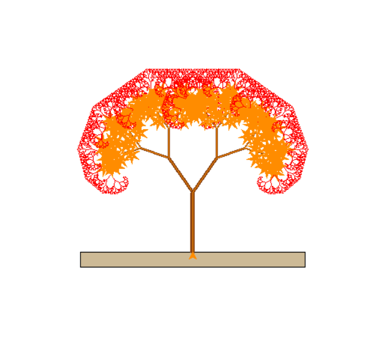

<h5 style="text-align:center;">A fractal tree is a tree made up by creating recursive branching in a graphics module in python.
i used turtle module.
first of all ,i imported turtle module .
Then i needed branches which the basic idea of it is to go forward , then a little bit left ,then back to the origin and move right to make a ("Y") shape .
after all , repeating it on a loop with reducing distance and here we go !!!</h5>

######
'''
import turtle
turtle.speed(0)
def square():
    turtle.fillcolor("Wheat3")
    turtle.begin_fill()
    n=2
    for i in range(n):
        turtle.forward(300)
        turtle.right(90)   
        turtle.forward(20)
        turtle.right(90)
    turtle.end_fill() 
square()    
turtle.forward(150)
turtle.left(90)

def star(n,d,c):
    turtle.fillcolor(c)
    turtle.begin_fill()
    for i in range(n):
        turtle.right(180-180/n)
        turtle.forward(d)
    turtle.end_fill() 

def tree(d,r,s):
    turtle.pensize(s)
    if d<1 :
        return
    if d>=20:
        turtle.pencolor("chocolate4")
    if 5<d<20:
        turtle.pencolor("DarkOrange")  
    if d<=5:
        turtle.pencolor("Red")    
    turtle.forward(d)
    turtle.left(r)
    tree(0.7*d,r,s*0.7)
    turtle.right(2*r)
    tree(0.7*d,r,s*0.7)
    turtle.left(r)
    turtle.backward(d)
    
    if 9<d<20:
        turtle.pencolor("DarkOrange")
        star(7,25,"DarkOrange")
turtle.tracer(0)
tree(80,35,6)
turtle.update()
turtle.exitonclick()
'''
######
